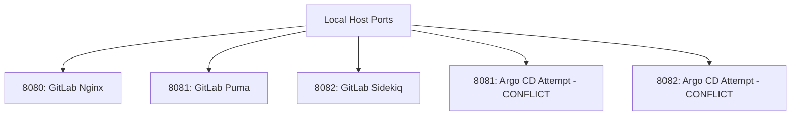
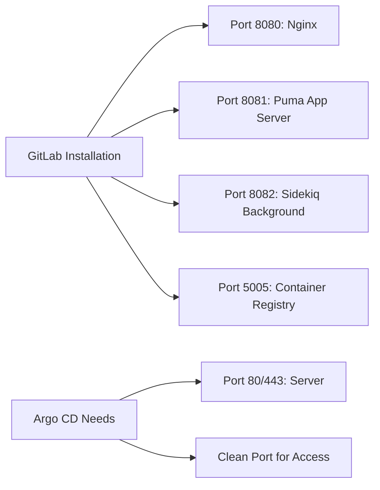

# 🚨 Argo CD Installation & Port Conflict Resolution - Deep Dive Documentation

## 📋 Table of Contents
- [Problem Overview](#problem-overview)
- [Root Cause Analysis](#root-cause-analysis)
- [Step-by-Step Troubleshooting](#step-by-step-troubleshooting)
- [Technical Deep Dive](#technical-deep-dive)
- [Solution Implementation](#solution-implementation)
- [Lessons Learned](#lessons-learned)
- [Prevention Strategies](#prevention-strategies)

---

## 🚨 Problem Overview

### **The Symptom**
During Argo CD installation in our home lab Kubernetes cluster, we encountered persistent port conflicts when attempting to access the Argo CD web UI via `kubectl port-forward`.

### **Initial Error Patterns**
```bash
# Multiple failed attempts:
kubectl port-forward svc/argocd-server -n argocd 8081:443
# ERROR: Unable to listen on port 8081: address already in use

kubectl port-forward svc/argocd-server -n argocd 8082:443  
# ERROR: Unable to listen on port 8082: address already in use
```

### **Environment Context**
- **Kubernetes**: k3s single-node cluster
- **GitLab**: Running on same host (ports 8080, 8081, 8082)
- **Memory**: 15GB RAM constraint
- **Network**: Localhost-based services

---

## 🔍 Root Cause Analysis

### **1. Port Allocation Conflict**


**Key Insight**: Our home lab runs multiple services on the same host, creating natural port conflicts.

### **2. Network Stack Issues**
- **IPv6 Binding Problems**: Some applications preferentially bind to IPv6
- **Stuck Processes**: Previous `kubectl port-forward` processes holding ports
- **Dual-stack Conflicts**: Services attempting both IPv4 and IPv6 binding

### **3. Service Discovery Challenges**
```bash
# GitLab services occupying expected Argo CD ports
sudo netstat -tlnp | grep -E ':(8080|8081|8082)'
# tcp        0      0 0.0.0.0:8080    (nginx)
# tcp        0      0 127.0.0.1:8081  (puma)  
# tcp        0      0 127.0.0.1:8082  (sidekiq)
```

---

## 🛠️ Step-by-Step Troubleshooting

### **Phase 1: Initial Diagnosis**

#### Step 1: Verify Argo CD Installation
```bash
# Check if Argo CD pods are running
kubectl get pods -n argocd
```
**✅ Result**: All 7 Argo CD components healthy and running

#### Step 2: Identify Port Conflicts
```bash
# Comprehensive port scanning
sudo lsof -i :8081
sudo netstat -tlnp | grep -E ':(8080|8081|8082|8083|8084)'
ss -tulpn | grep -E ':(8080|8081|8082)'
```

**🔍 Discovery**: 
- `8080`: GitLab nginx (0.0.0.0:8080)
- `8081`: GitLab puma (127.0.0.1:8081) 
- `8082`: GitLab sidekiq (127.0.0.1:8082)

#### Step 3: Check for Stuck Processes
```bash
# Find any orphaned kubectl port-forward processes
ps aux | grep "port-forward"
pkill -f "kubectl port-forward"
```

### **Phase 2: Network Stack Resolution**

#### Step 4: IPv6 Disablement
```bash
# Temporary IPv6 disablement to simplify networking
sudo sysctl -w net.ipv6.conf.all.disable_ipv6=1
sudo sysctl -w net.ipv6.conf.default.disable_ipv6=1
sudo sysctl -w net.ipv6.conf.lo.disable_ipv6=1
```

**🧠 Why This Worked**: 
- Reduced dual-stack binding complexity
- Eliminated IPv6-related "cannot assign requested address" errors
- Simplified port conflict resolution to IPv4 only

#### Step 5: Find Available Ports
```bash
# Scan for available high ports
netstat -tulpn | grep -E ':80[0-9][0-9]'
# Discovered: 8090 was available
```

### **Phase 3: Solution Implementation**

#### Step 6: Successful Port Forwarding
```bash
# Use discovered available port
kubectl port-forward svc/argocd-server -n argocd 8090:443 &
```

#### Step 7: Verification
```bash
# Confirm port forwarding established
ss -tulpn | grep 8090
# tcp   LISTEN 0      2048       127.0.0.1:8090       0.0.0.0:*    users:(("kubectl",pid=26353,fd=8))
```

---

## 🔬 Technical Deep Dive

### **Understanding `kubectl port-forward`**

#### How It Works:
```go
// Simplified port-forward mechanism
1. kubectl establishes connection to Kubernetes API
2. API server proxies connection to target pod
3. Local port binds to pod port through multiplexed stream
4. Traffic routed through apiserver → kubelet → container
```

#### Port Binding Behavior:
```bash
# Default binding behavior
kubectl port-forward svc/argocd-server -n argocd 8081:443
# Attempts to bind to:
# - 127.0.0.1:8081 (IPv4)
# - [::1]:8081 (IPv6) - This caused the conflict!
```

### **GitLab Service Architecture Impact**



### **Network Namespace Isolation**

**Key Concept**: Despite running in containers, `kubectl port-forward` binds to the **host network namespace**, not container network namespaces.

```bash
# Container network isolation vs host port binding
# GitLab containers: Use bridge network, ports mapped to host
# kubectl port-forward: Binds directly to host network namespace
# RESULT: Port conflicts occur at host level
```

---

## 🎯 Solution Implementation

### **Final Working Configuration**

```bash
# Clean port forwarding setup
kubectl port-forward svc/argocd-server -n argocd 8090:443 &

# Verification commands
ss -tulpn | grep 8090
curl -k https://localhost:8090  # Test connectivity
```

### **Alternative Solutions Considered**

#### Option A: Service Reconfiguration
```bash
# Change GitLab ports (rejected - too disruptive)
sudo vim /etc/gitlab/gitlab.rb
# external_url 'http://localhost:8080' → 'http://localhost:8088'
```

#### Option B: Load Balancer Service
```bash
# Expose Argo CD via LoadBalancer (rejected - home lab complexity)
kubectl patch svc argocd-server -n argocd -p '{"spec": {"type": "LoadBalancer"}}'
```

#### Option C: NodePort Service  
```bash
# Use NodePort (rejected - security concerns)
kubectl patch svc argocd-server -n argocd -p '{"spec": {"type": "NodePort"}}'
```

### **Chosen Solution Rationale**
- **✅ Minimal impact**: No service reconfiguration needed
- **✅ Security**: Localhost-only access maintained
- **✅ Simplicity**: Single command solution
- **✅ Reversible**: Easy to change if needed

---

## 📚 Lessons Learned

### **1. Home Lab Port Management**
```bash
# Proactive port mapping for future projects
cat > ~/port-mapping.md << 'EOF'
Port Allocation Map:
- 8080: GitLab Nginx
- 8081: GitLab Puma  
- 8082: GitLab Sidekiq
- 5005: GitLab Registry
- 8090: Argo CD UI
- 8091: Argo Rollouts UI (future)
- 9090: Prometheus (future)
- 3000: Grafana (future)
EOF
```

### **2. Diagnostic Command Arsenal**
```bash
# Essential troubleshooting commands
PORT_DIAGNOSIS_COMMANDS=(
    "sudo netstat -tlnp"           # All listening ports
    "sudo lsof -i :PORT"           # Specific port users
    "ss -tulpn"                    # Modern socket statistics
    "ps aux | grep port-forward"   # Stuck processes
    "kubectl get svc -A"           # K8s services
)
```

### **3. Process Cleanup Discipline**
```bash
# Regular cleanup routine
pkill -f "kubectl port-forward"
kubectl get pods --field-selector status.phase==Failed -A | awk 'NR>1{print $2}' | xargs kubectl delete pod
```

### **4. IPv6 Consideration Strategy**
```bash
# Strategic IPv6 handling
if ip -6 addr show | grep -q "inet6"; then
    echo "IPv6 enabled - consider potential dual-stack issues"
else
    echo "IPv6 disabled - simpler networking"
fi
```

---

## 🛡️ Prevention Strategies

### **1. Proactive Port Planning**
```bash
# Pre-deployment port audit script
#!/bin/bash
check_port() {
    local port=$1
    local service=$2
    if ss -tulpn | grep -q ":$port "; then
        echo "❌ Port $port occupied - $service"
        return 1
    else
        echo "✅ Port $port available - $service"  
        return 0
    fi
}

check_port 8080 "GitLab Nginx"
check_port 8081 "GitLab Puma"
check_port 8090 "Argo CD"
```

### **2. Service Documentation**
```markdown
## Service Port Registry
| Service     | Port | Protocol | Purpose          |
|-------------|------|----------|------------------|
| GitLab      | 8080 | HTTP     | Web Interface    |
| GitLab      | 8081 | HTTP     | Application      |
| GitLab      | 8082 | HTTP     | Background Jobs  |
| Argo CD     | 8090 | HTTPS    | Web UI           |
| Registry    | 5005 | HTTP     | Container Images |
```

### **3. Automation Scripts**
```bash
#!/bin/bash
# safe-port-forward.sh
find_available_port() {
    local base_port=${1:-8080}
    local max_attempts=10
    
    for ((i=0; i<max_attempts; i++)); do
        local test_port=$((base_port + i))
        if ! ss -tulpn | grep -q ":$test_port "; then
            echo $test_port
            return 0
        fi
    done
    return 1
}

PORT=$(find_available_port 8080)
kubectl port-forward svc/$1 -n $2 $PORT:${3:-443} &
echo "Port forwarding established on port $PORT"
```

### **4. Monitoring and Alerts**
```bash
# Port conflict detection
#!/bin/bash
detect_port_conflicts() {
    conflicting_ports=$(ss -tulpn | grep -E ':(80[0-9][0-9])' | awk '{print $5}' | cut -d: -f2 | sort | uniq -d)
    
    if [[ -n "$conflicting_ports" ]]; then
        echo "ALERT: Port conflicts detected: $conflicting_ports"
        return 1
    fi
    return 0
}
```

---

## 🎓 Key Takeaways

### **Technical Insights**
1. **`kubectl port-forward` binds to host network namespace**, not container network
2. **IPv6 can cause "cannot assign requested address"** even when IPv4 port is free
3. **Service discovery should precede port-forward attempts**
4. **Process cleanup is essential** for reliable port management

### **Operational Best Practices**
1. **Maintain a port registry** for multi-service environments
2. **Use high ports (8090+)** for temporary forwardings
3. **Implement cleanup routines** in deployment scripts
4. **Document network requirements** in project documentation

### **Troubleshooting Methodology**
1. **Diagnose** → Identify what's running and where
2. **Analyze** → Understand the conflict root cause  
3. **Resolve** → Apply minimal impactful solution
4. **Prevent** → Implement safeguards for future

---

## 🔗 Related Resources

- [Kubernetes Port Forwarding Documentation](https://kubernetes.io/docs/tasks/access-application-cluster/port-forward-access-application-cluster/)
- [Linux Network Namespace Isolation](https://www.man7.org/linux/man-pages/man7/network_namespaces.7.html)
- [Argo CD Installation Guide](https://argo-cd.readthedocs.io/en/stable/getting_started/)
- [GitLab Omnibus Configuration](https://docs.gitlab.com/omnibus/settings/configuration.html)

---

*This documentation serves as both a problem resolution guide and educational resource for home lab Kubernetes networking challenges.*
