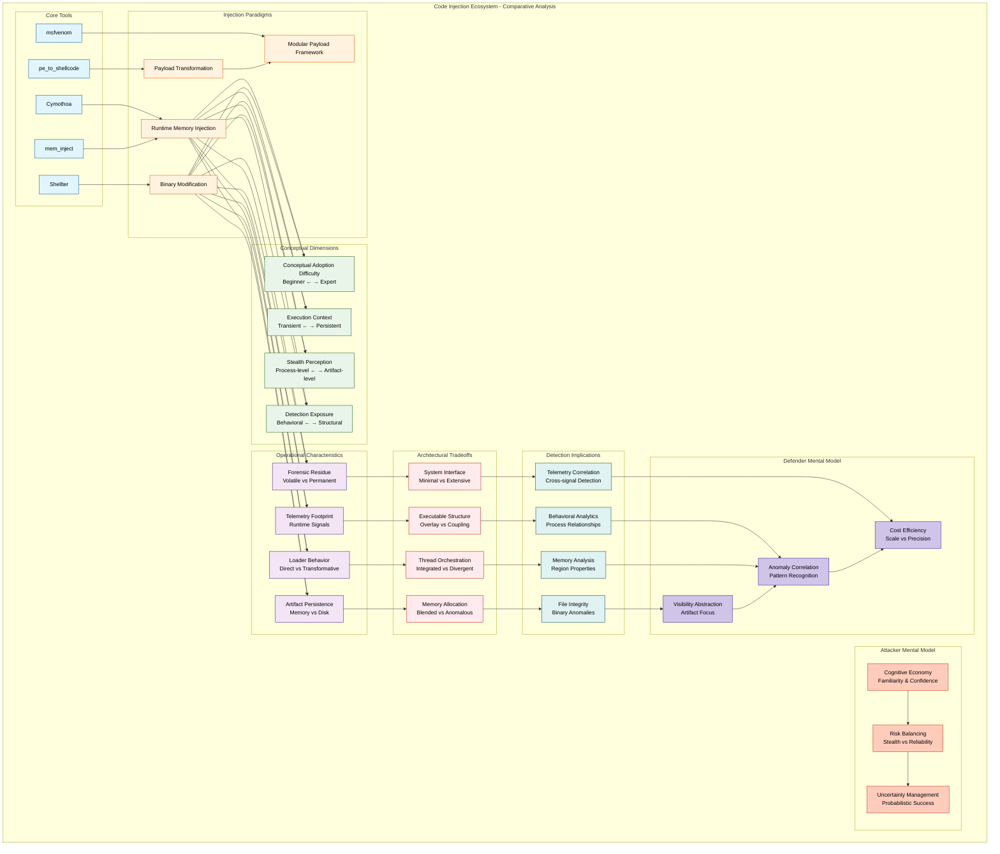

**Title: Conceptual Foundations of Code Injection Tools: Comparative Modeling Across Cymothoa, mem_inject, Shellter, pe_to_shellcode, and msfvenom**

**Abstract:**
Code injection represents a foundational execution paradigm within offensive security and adversarial malware development, enabling software to execute within the memory space or structural context of another process or binary. Understanding this paradigm requires separating conceptual categories rather than focusing prematurely on implementation mechanics. This article establishes a beginner-accessible but analytically rigorous framework for understanding five widely discussed tools—Cymothoa, mem_inject, Shellter, pe_to_shellcode, and msfvenom—through the lens of conceptual modeling rather than operational detail. The discussion distinguishes runtime memory injection from binary modification approaches and explains how these paradigms influence perceived stealth, usability, and defensive visibility. Each tool is positioned within an abstraction spectrum ranging from direct memory manipulation utilities to payload generation frameworks and binary transformation engines. The article further introduces foundational attacker and defender mental models to explain why different tools are chosen under varying constraints. By emphasizing conceptual adoption difficulty, usage context, and basic detection exposure rather than technical internals, this level provides an educational scaffold suitable for students, junior analysts, and early-career security practitioners. This conceptual baseline prepares readers for deeper operational and architectural analysis in subsequent levels.

**Keywords:** Code Injection, Memory Execution, Binary Modification, Offensive Tooling, Defensive Visibility

The concept of code injection can be understood as an execution strategy in which one program causes another program or process to execute instructions that were not originally part of its design. This strategy differs from conventional execution because the injected logic operates under the trust boundaries and permissions of a host environment. Conceptually, injection is less about how instructions are delivered and more about where execution ultimately occurs. The paradigm therefore revolves around execution context borrowing, where the host process becomes a carrier of foreign behavior. This borrowed context often influences how security tools interpret legitimacy, because defensive systems frequently rely on assumptions about normal process behavior. Understanding this distinction is essential before comparing tools, since each tool manipulates the execution context differently at a conceptual level.

A key conceptual divide exists between runtime memory injection and binary modification approaches. Runtime memory injection involves introducing executable content into an already running process or into memory that will soon execute without permanently altering the original file on disk. Binary modification, in contrast, alters the executable artifact itself so that the injected behavior becomes part of the program’s structure before execution begins. From a conceptual perspective, runtime methods emphasize transience and environmental dependency, whereas binary modification emphasizes persistence within the artifact lifecycle. This distinction shapes both attacker decision-making and defender detection opportunities. It also explains why some tools are perceived as stealthier even when they ultimately produce similar behavioral outcomes.

Cymothoa conceptually represents a runtime injection utility that focuses on interacting with processes that already exist within the operating system environment. Its mental model revolves around attaching foreign logic to a living execution entity rather than creating a new standalone program. This positioning makes it conceptually appealing for scenarios where blending with existing activity is desirable. The tool’s abstraction level suggests that the user must understand process relationships and execution contexts at a higher level than with automated payload generators. As a result, its conceptual adoption curve is steeper, but it offers flexibility in thinking about execution placement. The perceived stealth of such tools arises from the idea that no new program visibly appears to the user or operating system interface.

mem_inject occupies a similar conceptual category but is often viewed as a more direct or minimalistic mechanism for introducing foreign execution into a target environment. Conceptually, it emphasizes the act of transferring executable content into memory rather than broader workflow orchestration. This narrower conceptual scope can make it easier to understand in isolation, even if practical usage still requires contextual knowledge. The tool’s abstraction level implies fewer automated decisions, placing more cognitive responsibility on the operator. From a learning standpoint, it represents a bridge between theoretical understanding and practical experimentation with injection ideas. Its existence highlights that injection tooling can vary widely in how much operational logic they embed versus how much they delegate to the user.

Shellter introduces a different conceptual paradigm by focusing on modifying existing executable files rather than operating exclusively at runtime. This binary modification orientation changes how users think about stealth because the injected logic becomes intertwined with legitimate software structure. Conceptually, the approach relies on camouflage through coexistence with trusted binaries rather than invisibility through ephemeral execution. This distinction is important because it reframes detection risk from runtime anomalies to artifact integrity concerns. Shellter’s automation level also influences conceptual adoption, as it abstracts many complexities while still requiring understanding of executable behavior. The tool therefore occupies an intermediate conceptual space between manual injection utilities and fully automated payload frameworks.

pe_to_shellcode shifts attention toward transformation rather than injection as a primary mental model. Conceptually, it converts one form of executable representation into another form more suitable for embedding within different contexts. This makes it less of an injector itself and more of an enabler within a broader execution pipeline. The abstraction encourages users to think about portability of execution logic across environments rather than direct process manipulation. Such tools highlight that code injection ecosystems often consist of composable components rather than single monolithic utilities. Understanding this conceptual role is essential because defenders may observe artifacts produced by transformation tools even when they never see the original injector.

msfvenom represents yet another conceptual category as a payload generation framework that supports multiple delivery paradigms, including injection-compatible outputs. Its mental model emphasizes modularity and automation, allowing users to generate execution-ready components without deep knowledge of underlying mechanisms. Conceptually, this lowers the barrier to entry significantly compared to specialized injection utilities. The tool’s versatility means it can participate in both runtime and binary modification workflows depending on how outputs are used. From an educational perspective, it often becomes the first exposure many learners have to injection-compatible payload concepts. This accessibility influences attacker behavior because ease of use can outweigh theoretical stealth advantages.

From an attacker mental model perspective, tool selection is rarely driven solely by technical capability and is instead shaped by cognitive economy. Operators often choose tools that align with their familiarity, perceived reliability, and confidence under uncertainty. A beginner may gravitate toward automated frameworks because they reduce cognitive load, while an experienced practitioner may prefer flexible utilities that allow nuanced control over execution placement. The perception of stealth frequently depends more on narrative belief than empirical measurement, especially among less experienced users. This psychological dimension means that tool reputation can influence adoption patterns independently of actual detection resistance. Understanding attacker cognition helps defenders anticipate which tools are more likely to appear in different threat maturity tiers.

From a defender mental model perspective, visibility is typically framed around observable artifacts rather than the conceptual injection paradigm itself. Signature-based antivirus systems historically focused on identifying known malicious binaries or patterns within files, making binary modification tools more exposed if artifacts were reused across campaigns. Simple endpoint detection systems expanded visibility by monitoring suspicious process relationships or unusual execution contexts, which increased exposure for runtime injection approaches. However, defenders often rely on heuristics that assume typical software behavior, meaning unfamiliar execution relationships may trigger alerts regardless of tool sophistication. The defensive challenge therefore lies in distinguishing malicious injection from legitimate software behaviors that use similar mechanisms. This conceptual tension explains why detection effectiveness varies widely across environments.

Comparatively, the five tools can be positioned along several foundational dimensions that influence both usability and detection perception. Ease of conceptual adoption ranges from highly automated frameworks to utilities requiring deeper understanding of execution environments. Injection paradigm category differentiates runtime interaction tools from binary modification and transformation tools, shaping how users think about execution timing. Usage context varies from targeted experimentation to broader offensive workflows, affecting how frequently tools appear in real-world scenarios. Basic stealth perception emerges from whether execution appears transient or embedded within legitimate artifacts. Defender visibility abstraction depends on whether detection systems primarily observe files, processes, or relationships between them, creating different exposure profiles for each tool.

**Title: Operational Behavior and Telemetry Exposure in Code Injection Frameworks: Comparative Analysis of Cymothoa, mem_inject, Shellter, pe_to_shellcode, and msfvenom**

**Abstract:**
Operational behavior and telemetry exposure define how code injection tools manifest within monitored computing environments, influencing both adversary decision-making and defensive detection strategies. Building upon foundational conceptual distinctions, this article examines five tools—Cymothoa, mem_inject, Shellter, pe_to_shellcode, and msfvenom—through the lens of loader behavior, artifact formation, forensic residue, and enterprise telemetry visibility. Rather than focusing on internal implementation mechanics, the analysis explores how different injection paradigms create observable signals across host-based monitoring systems and endpoint detection platforms. Reflective loading concepts, process replacement models, and binary rewriting approaches are compared in terms of persistence characteristics and environmental adaptability. The discussion also introduces conceptual alignment with adversarial tactics described in the MITRE ATT&CK framework, highlighting how tools map onto execution and defense evasion behaviors without prescribing operational usage. Enterprise-scale detection scenarios are used to illustrate how telemetry friction varies depending on organizational maturity and monitoring depth. The article concludes by modeling operational security tradeoffs that influence attacker tool selection under uncertainty. This level provides intermediate practitioners with a telemetry-centered perspective necessary for both offensive planning and defensive analysis.

**Keywords:** Telemetry Exposure, Reflective Loading, Process Manipulation, Forensic Artifacts, Detection Friction

Operationally, code injection tools differ most significantly in how their loaders interact with host environments during execution preparation. Some tools emphasize embedding execution logic directly into the memory space of an existing process through self-contained loading routines, while others rely on modifying executable structures before execution begins. This distinction influences not only runtime behavior but also the types of artifacts left behind for forensic examination. Tools associated with reflective execution models tend to produce transient artifacts concentrated in volatile memory regions, whereas binary rewriting approaches generate persistent disk-level modifications that remain observable after execution completes. The operational lifecycle therefore becomes a primary differentiator in detection modeling. Understanding lifecycle phases allows analysts to reason about when and where telemetry signals are most likely to emerge.

Cymothoa and mem_inject occupy operational territory characterized by runtime interaction with active processes, but their behavioral footprints differ in how they initiate and maintain execution relationships. These tools conceptually produce telemetry signals tied to inter-process interactions rather than standalone program launches. Such relationships may appear anomalous within enterprise monitoring environments that baseline normal process communication patterns. Because execution occurs within an already trusted context, the observable footprint can shift from binary identity toward behavioral anomalies. This creates detection friction variability depending on how mature the monitoring environment is. In organizations with limited behavioral monitoring, such activity may appear inconspicuous, whereas advanced telemetry correlation systems may flag it quickly.

Shellter introduces a contrasting operational model in which execution artifacts originate at the file level before runtime activity even begins. The modification of legitimate binaries creates telemetry that blends attributes of trusted software with anomalous behavior patterns. This hybrid artifact profile complicates detection because security systems must reconcile conflicting signals about trustworthiness. From a forensic perspective, residue persists beyond execution, allowing retrospective analysis to uncover anomalies even if runtime detection fails. The persistence characteristic alters incident response timelines by extending investigative opportunities. Consequently, operational tradeoffs between stealth and persistence become central to evaluating such tools.

pe_to_shellcode functions primarily as a transformation stage within broader workflows, and its operational visibility often manifests indirectly through artifacts produced downstream. The conversion of executable formats into portable representations enables embedding into various execution contexts, which can diversify telemetry exposure patterns. Rather than producing a single consistent behavioral signature, outputs derived from transformation tools may appear across multiple operational scenarios. This variability complicates both attacker planning and defender detection modeling because exposure depends heavily on how transformed artifacts are ultimately deployed. The tool therefore contributes to environmental adaptability rather than direct execution presence. Its role highlights how injection ecosystems include preparatory stages that influence later telemetry outcomes.

msfvenom demonstrates high operational variability due to its modular payload generation capabilities, which allow outputs to align with multiple execution paradigms. This flexibility introduces a wide spectrum of possible telemetry footprints, ranging from file-based artifacts to memory-centric execution signals. From a detection standpoint, variability increases uncertainty because defenders cannot rely on a single behavioral pattern to identify tool usage. However, automation can also introduce recognizable structural similarities across generated artifacts, which may aid detection in environments with strong signature intelligence. Operational adaptability thus becomes both an advantage and a liability depending on defensive sophistication. The interplay between automation and uniqueness becomes a critical factor in exposure modeling.

Artifact persistence represents a major comparative dimension across the tools, influencing both detection probability and investigative depth. Runtime-oriented tools often prioritize minimal persistence to reduce long-term exposure, but this transience can also limit operational reliability if execution fails or environments change. Binary modification approaches generate longer-lived artifacts that may improve execution consistency while increasing forensic traceability. Transformation tools create artifacts whose persistence depends entirely on downstream usage contexts, adding another layer of uncertainty. These differences affect how defenders design monitoring strategies, as persistent artifacts allow retrospective hunting while transient artifacts require real-time detection capabilities. Persistence therefore acts as both a risk and a resource depending on perspective.

Telemetry footprint variability further differentiates tools by determining how consistent observable signals remain across environments. Tools that rely heavily on environmental conditions may produce inconsistent telemetry, complicating detection but also increasing operational unpredictability for attackers. Conversely, tools with more deterministic behavior patterns may be easier to detect once signatures are developed, but they provide more reliable outcomes for operators. Enterprise monitoring maturity plays a decisive role in how variability influences detection friction. Highly instrumented environments can correlate weak signals across multiple telemetry sources, reducing the advantage of variability. Less mature environments may fail to detect even consistent anomalies, allowing deterministic tools to succeed more often.

From an attacker mental model perspective, operational security decisions revolve around balancing reliability, adaptability, and exposure risk under uncertainty. Operators rarely possess complete knowledge of defensive monitoring capabilities within target environments, forcing them to rely on probabilistic reasoning. Tools that offer flexible deployment options may appear safer because they allow adjustment if initial attempts fail. However, flexibility also introduces complexity, which can increase operator error and inadvertently generate more telemetry. The psychological comfort of automation often competes with the perceived stealth of manual control. These cognitive tradeoffs influence tool selection as much as technical capability does.

From a defender mental model perspective, telemetry interpretation focuses on reducing ambiguity within large volumes of behavioral data. Analysts must determine whether anomalous signals represent malicious injection, benign software behavior, or environmental noise. Tools that blend with legitimate execution contexts create cognitive challenges because they undermine assumptions about trust boundaries. Detection strategies therefore emphasize correlation across multiple signals rather than reliance on single indicators. Enterprise defenders also consider cost efficiency, prioritizing detection approaches that scale across many endpoints without excessive false positives. Understanding attacker uncertainty helps defenders design controls that increase adversary risk perception even when detection is not guaranteed.

Mapping these tools conceptually to adversarial behavior frameworks such as the MITRE ATT&CK model reveals their alignment with execution and defense evasion tactics without requiring implementation detail. Runtime interaction tools align with techniques involving process manipulation and in-memory execution, while binary modification tools correspond to artifact alteration strategies. Transformation tools contribute to payload preparation stages that enable multiple downstream techniques. The mapping demonstrates that tools themselves are less important than the behaviors they enable within adversarial campaigns. Detection engineering therefore benefits from focusing on behavioral patterns rather than tool signatures. This behavioral abstraction becomes increasingly important as adversaries adapt and tooling ecosystems evolve.

**Title: Architectural Tradeoffs and Detection Engineering Implications in Code Injection Ecosystems: A Comparative Framework for Cymothoa, mem_inject, Shellter, pe_to_shellcode, and msfvenom**

**Abstract:**
Architectural modeling of code injection tools provides deeper insight into how execution strategies interact with modern detection engineering methodologies. This article analyzes Cymothoa, mem_inject, Shellter, pe_to_shellcode, and msfvenom through the lens of executable structure manipulation, in-memory execution architectures, system interface exposure, thread orchestration paradigms, and memory allocation implications. Rather than focusing on procedural implementation, the discussion frames architectural decisions as tradeoffs that influence both adversary success probability and defender analytical leverage. The analysis introduces a taxonomy that groups tools into injection paradigm families based on how they transform or inhabit execution contexts. Detection engineering counter-strategies are examined conceptually, emphasizing behavioral modeling, anomaly correlation, and architectural signal identification. A narrative architectural tradeoff matrix is presented to highlight tensions between stealth, reliability, portability, and detection exposure. Attacker and defender cognitive perspectives are analyzed separately to illustrate how each side interprets architectural constraints differently. The article concludes by synthesizing strategic classification principles that enable both red and blue teams to reason about injection technologies beyond individual tool names. This architectural perspective provides a foundation for future research into adaptive detection and adversarial resilience.

**Keywords:** Execution Architecture, Memory Allocation, Thread Orchestration, Behavioral Detection, Injection Taxonomy

Architecturally, code injection tools can be understood as systems that manipulate execution boundaries through different structural strategies rather than merely delivering payloads. Some tools embed foreign execution within existing address spaces, while others reshape executable artifacts to incorporate additional logic before runtime. These architectural differences determine how operating systems perceive execution lineage, which in turn affects monitoring visibility. The architecture also defines dependencies on system interfaces, influencing portability across environments and susceptibility to monitoring instrumentation. By examining architecture instead of surface behavior, analysts gain a more stable framework for comparison that remains valid even as tools evolve. This perspective shifts attention from tool identity to execution design principles.

Executable structure manipulation forms one axis of architectural differentiation, particularly when comparing transformation-oriented tools with runtime-focused injectors. Tools that alter executable structures create composite binaries where original and injected logic coexist within a single artifact, producing architectural coupling between legitimate functionality and foreign execution paths. Runtime injectors instead create architectural overlays where foreign execution inhabits memory regions associated with another process without permanently modifying disk artifacts. These contrasting approaches affect how trust relationships propagate through execution hierarchies. Structural coupling can increase reliability because execution begins within a coherent artifact, while overlays rely on environmental stability at runtime. Detection opportunities emerge differently depending on whether anomalies appear in file integrity or memory behavior.

In-memory execution architecture further differentiates tools based on how they establish operational presence inside target environments. Some architectures emphasize self-contained execution units capable of operating independently once introduced into memory, while others depend more heavily on host process facilities for sustained operation. The degree of independence influences resilience against environmental changes such as process termination or system monitoring interventions. Architectures that tightly bind to host processes may appear more legitimate but inherit the host’s lifecycle risks. More autonomous execution units may be easier to detect due to structural anomalies yet offer operational persistence under certain conditions. This architectural tension highlights tradeoffs between camouflage and survivability.

System interface exposure represents another architectural dimension, particularly in how tools rely on operating system services to achieve execution. Architectures that depend extensively on high-level system interfaces may generate observable behavioral patterns that align with monitored application programming interfaces. Conversely, architectures that minimize reliance on monitored interfaces may reduce certain detection signals while increasing development complexity and potential instability. The choice of interface exposure influences not only detection risk but also portability across operating system versions and configurations. Detection engineers benefit from modeling interface exposure because it provides a consistent behavioral anchor independent of specific tool implementations. Architectural interface decisions therefore become strategic rather than purely technical.

Thread orchestration paradigms introduce additional architectural variability by determining how injected execution integrates with or diverges from host process execution flows. Some architectures align foreign execution with existing scheduling patterns to minimize anomalies, while others create distinct execution paths that may appear unusual under monitoring. The orchestration strategy influences timing characteristics, concurrency behavior, and interaction with host resources. These factors collectively affect how behavioral analytics systems interpret process activity. Architectural alignment with host execution may reduce immediate detection but complicate debugging and reliability for attackers. Divergent orchestration may increase detection risk but provide clearer operational control.

Memory allocation strategy implications also play a significant role in architectural modeling because they determine how execution regions are created, protected, and maintained within host environments. Allocation approaches influence spatial relationships between legitimate and foreign code regions, which can become detectable through memory analysis techniques. Some strategies prioritize blending with existing memory usage patterns, while others emphasize functional independence that may appear anomalous. Allocation decisions also affect fragmentation, lifetime management, and susceptibility to monitoring instrumentation. Detection engineers often exploit inconsistencies in memory usage patterns to identify injected execution contexts. Thus, allocation architecture contributes directly to detection surface area.

From an attacker mental model perspective, architectural decisions revolve around optimizing a multidimensional trade space involving stealth, reliability, portability, and development cost. Operators must anticipate defensive monitoring capabilities without full visibility, leading to probabilistic reasoning about which architectural approach presents the lowest risk. A highly sophisticated architecture may theoretically reduce detection exposure but introduce operational fragility that undermines mission success. Conversely, simpler architectures may generate more detectable signals yet succeed due to reliability and ease of deployment. Psychological factors such as familiarity and confidence strongly influence architectural preferences. The attacker’s goal becomes minimizing uncertainty rather than achieving perfect invisibility.

From a defender mental model perspective, architectural analysis enables the identification of invariant properties that persist across tool variations. Instead of attempting to detect individual tools, defenders focus on execution characteristics that violate expected system behavior regardless of implementation details. Architectural invariants such as anomalous execution lineage, unusual memory region properties, or inconsistent thread behavior provide durable detection anchors. Detection engineering therefore evolves toward behavioral modeling frameworks that remain effective even as adversaries modify tooling. Defenders also consider resource constraints, prioritizing detection strategies that provide maximum coverage with manageable false positive rates. Architectural reasoning helps allocate defensive investment efficiently across threat surfaces.

Detection engineering counter-strategy frameworks emerge from understanding how architectural choices expose observable signals at multiple layers simultaneously. Behavioral analytics can correlate anomalies across process relationships, memory characteristics, and execution timing to increase detection confidence. Architectural modeling also supports proactive threat hunting by identifying environments where certain injection paradigms would produce detectable inconsistencies. Rather than relying solely on reactive signatures, defenders can design monitoring systems that anticipate architectural weaknesses inherent to injection strategies. This predictive capability represents a shift from tool-centric detection toward paradigm-centric defense. Such approaches improve resilience against adversary adaptation.

A narrative architectural tradeoff matrix can classify the analyzed tools into paradigm families based on their dominant execution strategies. Runtime overlay injectors form one family characterized by environmental dependence and transient structural integration. Binary coupling tools form another family where execution is embedded within modified artifacts that persist across system states. Transformation enablers represent a supporting family that increases portability and composability across execution contexts. Modular payload frameworks occupy a cross-paradigm category capable of supporting multiple architectural approaches depending on configuration. This classification highlights that tool names are less important than architectural roles within the broader injection ecosystem.

